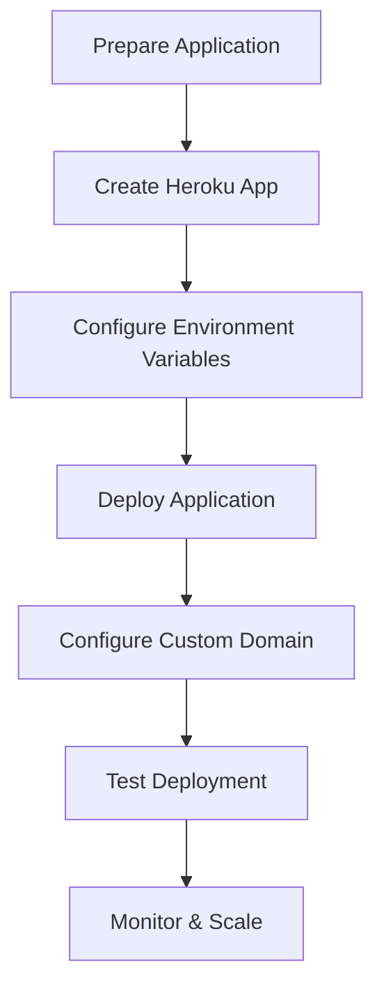
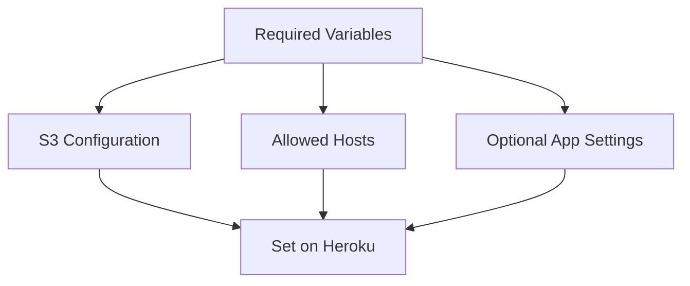
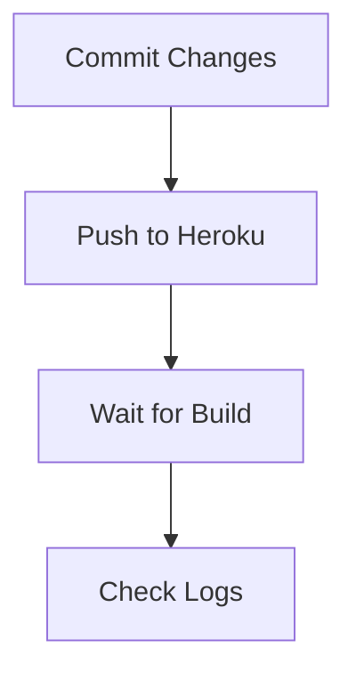
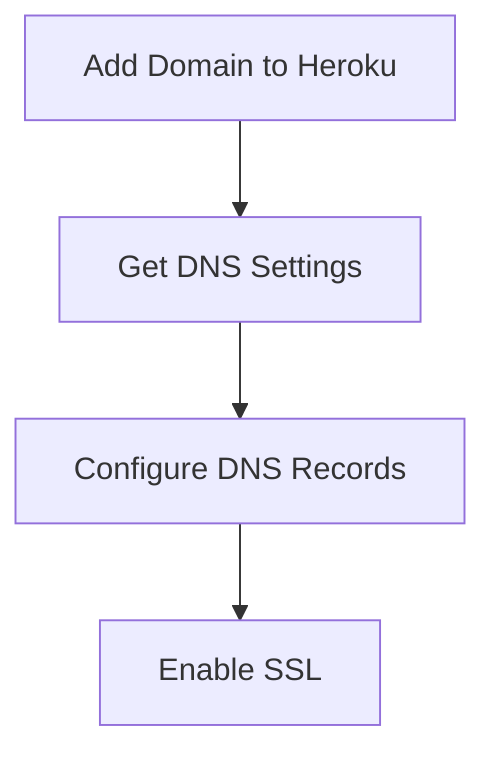
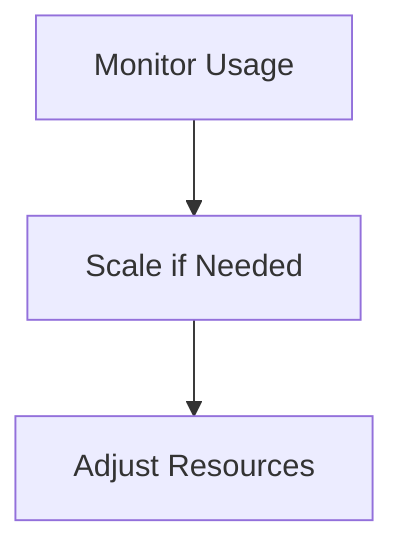
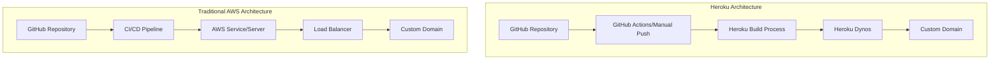

# Deploying Gitingest to Heroku with Custom Domain

This guide walks you through deploying your Gitingest app to Heroku and configuring your gitdocs.tech domain.

## Deployment Process Overview



## 1. Preparation for Heroku Deployment

The following files have been created/updated for Heroku deployment:

- **Procfile**: Tells Heroku how to run the application
- **runtime.txt**: Specifies the Python version

## 2. Creating a Heroku App


Run these commands:

```bash
# Login to Heroku
heroku login

# Create app (use a unique name)
heroku create gitdocs
```

## 3. Configuring Environment Variables



Based on the project code, you'll need to set these environment variables:

```bash
# S3 Configuration (required for cloud storage)
heroku config:set GITINGEST_S3_BUCKET=your-s3-bucket-name
heroku config:set AWS_ACCESS_KEY_ID=your-aws-access-key
heroku config:set AWS_SECRET_ACCESS_KEY=your-aws-secret-key
heroku config:set AWS_REGION=your-aws-region

# Allowed hosts for the application
heroku config:set ALLOWED_HOSTS=gitdocs.tech,*.gitdocs.tech,herokuapp.com,*.herokuapp.com
```

## 4. Manual Deployment to Heroku



To deploy:

```bash
# Commit any changes
git add .
git commit -m "Prepare for Heroku deployment"

# Push to Heroku
git push heroku main

# If you're on a different branch
# git push heroku yourbranchname:main
```

## 5. Configuring Custom Domain (gitdocs.tech)



Steps to configure your domain:

```bash
# Add your domain
heroku domains:add gitdocs.tech

# Add www subdomain (recommended)
heroku domains:add www.gitdocs.tech

# Get Heroku's DNS settings
heroku domains
```

You'll receive DNS target information from Heroku. Configure your domain with:

1. Create a CNAME record for `www.gitdocs.tech` pointing to the Heroku DNS target
2. Create an ALIAS/ANAME record for `gitdocs.tech` (apex domain) pointing to the same target
3. If ALIAS/ANAME isn't supported, use the IP addresses provided by Heroku with A records

Then enable SSL:

```bash
heroku certs:auto:enable
```

## 6. Testing Your Deployment


```bash
# Open your app
heroku open

# Check logs if there are issues
heroku logs --tail
```

## 7. Monitoring and Scaling



```bash
# Check app status
heroku ps

# Scale dynos if needed (uses more dyno hours)
heroku ps:scale web=2
```

## 8. Automation (Optional)

You can automate deployments with GitHub Actions:

1. Create `.github/workflows/heroku-deploy.yml`
2. Configure GitHub secrets for Heroku
3. Push changes to trigger automatic deployments

## Heroku vs AWS Architecture



## Troubleshooting Common Issues

1. **Application Error or Crashed**: Check logs with `heroku logs --tail`
2. **Domain Not Working**: Verify DNS settings with `heroku domains`
3. **SSL Certificate Issues**: Run `heroku certs:auto`
4. **Build Failures**: Check build logs during deployment 